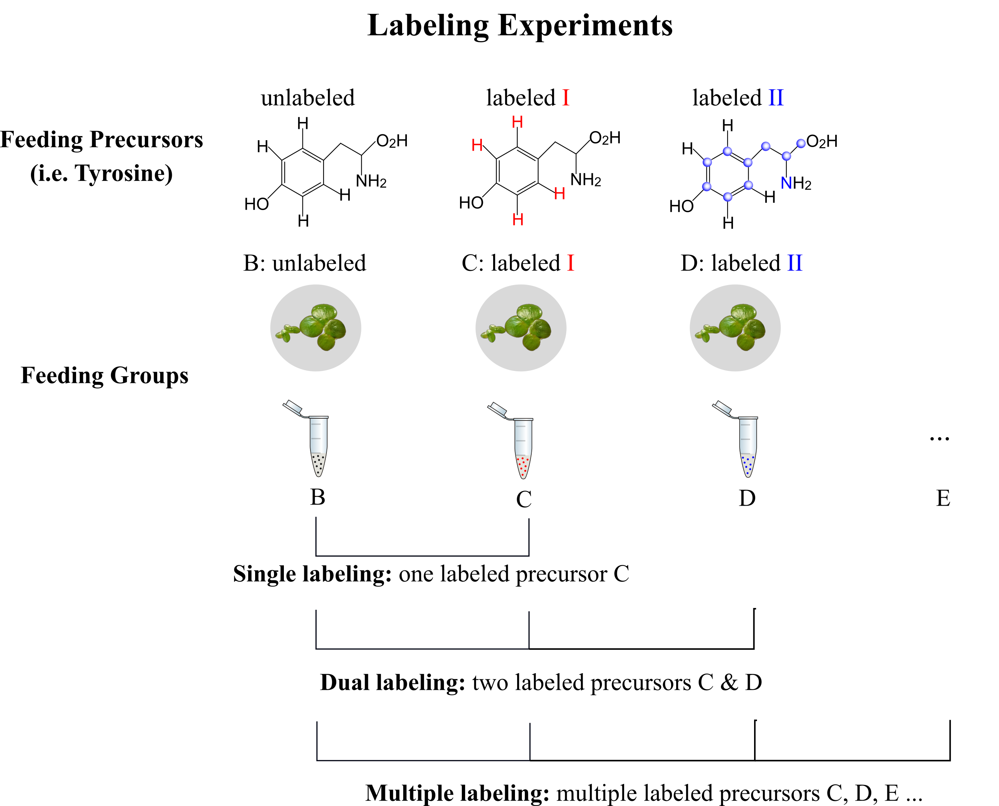
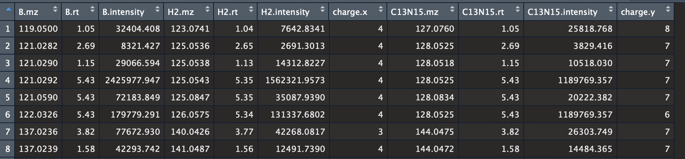

## Miso: An R Package for Multiple Isotope Labeling Assisted Metabolomics Data Analysis

Last update on 2019/02/08

## 1. Description

An R package to fish out isotopically labeled analytes in single, dual or multiple isotope labeling experiment.

**Features**

(1) **Fully automated**: Miso uses xcms object as input, and automatically processes the data by taking advantage of the phenoData from xcms object.

(2) **Flexible**: It enables detecting molecules labeled with various biologically relevant stable isotopes such as hydrogen (2H), carbon (13C), oxygen (18O), nitrogen (15N) and sulfur (34S). It can be applied to single, dual and multiple isotope labeling experiments without modifing any scripts. In addition, different algorithms are used to process the data with and without replicates.

(3) **Efficient**: fast

(4) **User-friendly**: Easy to use. Three different outputs are provided. (i): a full data table list, which includes a full list of isotopologues; (ii) a reduced data table list, in which only the base peaks of each isotopologues are included; (iii) the interactive plot, which allows the user to visually check the result.

## 2. Experiment Design

Figure 1 describes **single**, **dual** and **multiple** stable isotope labeling experiment. Detailed explainations regarding the experiment design and advantages of dual labeling experiments can be found in ([Liron et al., 2009](https://pubs.acs.org/doi/10.1021/ac901495a); [Liron et al., 2018](https://pubs.acs.org/doi/10.1021/acs.analchem.8b01644); [Dong et al., 2019](https://doi.org/10.1093/bioinformatics/btz092))

<p align="center"> 

</p>

<p align="center">
<b> Figure 1.</b>  Experimental set up for single, dual and multiple stable isotope labeling experiments
</p>

## 3. The Example Dataset

The example data (`Data/lcms.rda`) provided in this example is from a dual labeling experiment. It consists of 5 groups: Group A (SP medium, control group), Group B (0.5 mg mL<sup>−1</sup> unlabeled tyrosine), Group C (0.5 mg mL<sup>−1</sup> tyrosine D4, Label I), Group D (0.5 mg <sup>mL−1</sup> tyrosine 13C915N1, Label II), and Group E (0.5 mg mL<sup>−1</sup> Label I + Label II). 

The Groups B, C and D are shown in Figure 1. More details regarding the this dataset and experimental details can be found in ([Liron et al., 2018](https://pubs.acs.org/doi/10.1021/acs.analchem.8b01644)).


## 4. Quick Start

**Attention**: This tutorial is for Miso package version 0.2.0, which is slightly different from the version 0.1.5 described in the publication ([Dong et al., 2019](https://doi.org/10.1093/bioinformatics/btz092)). The old versions and related turotials can be found [here](https://github.com/YonghuiDong/Miso/releases).

### 4.1 Installation

```r
##(1) install stable version
install.packages("Miso")

##(2) install development version
devtools::install_github("YonghuiDong/Miso")
```

### 4.2 Turotial

#### (1) Load package

```r
library(Miso)
```
#### (2) First filtering

This step first selects all the possible labeled m/z peaks by comparing the MS signals among unlabeled and two dif- ferently labeled equivalent sample groups. This step could largely improve the overall data analysis time

Set `reps = FALSE` if your sample groups do not contain any replicates or you think the variations among the replicates are too large. It will use a different algorithm to process the data.

Here we use Group B, C and D for our data analysis, and B is the unlabeled group. 

```r
explist <- prefilter(lcms, subgroup = c("B", "C", "D"), unlabel = "B", reps = TRUE, p = 0.05, folds = 10)
```

#### (3) Second filtering

Next, Miso earches for the isotopologue sets according to the defined labeling patterns with preset retention time and mass error windows .

(3.1) Group C was fed with four H2 labeled tyrosine (Figure 1).
Here we are interested in detecting molecules labeled with 4, 3 or 2 H2 (n11 = 4, n12 = 2).

```r
exp.B <- explist$B
exp.C <- explist$C
exp.D <- explist$D
iso.C <- diso(iso1 = 'H2', n11 = 4, n12 = 2, exp.base = exp.B, exp.iso = exp.C, ppm = 10, rt.dif = 6)
```

(3.2) Group D was fed with C13 and N15 labeled tyrosine (Figure 1)
Here we are interested in detecting molecules labeled with 9, 8, 7 or 6 C13, and 1 or 0 N15 (n11 = 9, n12 = 6 for C13, and n21 = 1, n22 = 0 for N15).

```r
iso.D <- diso(iso1 = 'C13', n11 = 9, n12 = 6, iso2 = 'N15', n21 = 1, n22 = 0,
exp.base = iso.C[, 1:3], exp.iso = exp.D, ppm = 10, rt.dif = 6)
```

#### (4) Generate results

Three types of results are provided. A Full list,  a reduced list which contains only the base peaks of all the isotopelogues and the interactive plot.

4.1) Full list

```r
full_Result <- Fresult(iso.C, iso.D)
```
(4.2) Reduced list

```r
reduced_Result <- Rresult(full_Result)
```

(4.3) Plot the result

```r
## view the first row of Full_result
isoplot(full_Result, 1)
```

#### (5) Results

The overall workflow takes approximately 2.2 min using a PC with 16 GB memory and a 3.1 GHz Intel Core i7 processor.

Example of the result (from reduced list) is shown in Figure 2.

<p align="center"> 

</p>

<p align="center">
<b> Figure 2.</b>  Example of the output table.
</p>


## 5. Attention    

1. R memory limit error may appear during data processing especially for high resolution dataset:   

`Error: memory exhausted (limit reached?), Error during wrapup: memory exhausted (limit reached?)` 

This error is due to the following script:

```r
## In group C, we are looking for analytes labeled with 5, 4, or 3 deuteriums (H2).
iso.C <- diso(iso1 = 'H2', n11 = 4, n12 = 2, exp.base = exp.B, exp.iso = exp.C, ppm = 10, rt.dif = 6)
```

To solve this memory limit problem, the above script can be decomposed into 3 sub-scripts, which respectively search for analytes labled with 4, 3, and 2 deuteriums (H2).

```r
iso.C5 <- diso(iso1 = 'H2', n11 = 4, n12 = 4, exp.base = exp.B, exp.iso = exp.C)
iso.C4 <- diso(iso1 = 'H2', n11 = 3, n12 = 3, exp.base = exp.B, exp.iso = exp.C)
iso.C3 <- diso(iso1 = 'H2', n11 = 2, n12 = 2, exp.base = exp.B, exp.iso = exp.C)

## The results are then combined as iso.C:
iso.C <- rbind(iso.C5, iso.C4, iso.C3)
```

The decomposition step is only usually necessasy for iso.C, as the result list has been significantly reduced. we do not have to do it again for iso.D.

2. Optionally, users can also perform deisotoping before running Miso.

```r
##(2) deisotoping and/or deadducting (optional)
library('CAMERA')
an <- xsAnnotate(lcms)
an <- groupFWHM(an)
an <- findIsotopes(an, maxcharge = 3)
peaklist <- getPeaklist(an)
peaklist$isotopes <- sub("\\[.*?\\]", "", peaklist$isotopes)
peaklist <- peaklist[peaklist$isotopes == '' | peaklist$isotopes == '[M]+', ]
```

## 6. Please Cite


If you find Miso useful, please consider citing our work :)

[1] L Feldberg, Y Dong, U Heinig, I Rogachev, A Aharoni (2018). [DLEMMA-MS-imaging for identification of spatially localized metabolites and metabolic network map reconstruction. Analytical chemistry 90 (17), 10231-10238](https://pubs.acs.org/doi/10.1021/acs.analchem.8b01644).

[2] Y Dong, L Feldberg, A Aharoni (2019). [Miso: An R Package for Multiple Isotope Labeling Assisted Metabolomics Data Analysis. Bioinformatics, btz092](https://doi.org/10.1093/bioinformatics/btz092).


